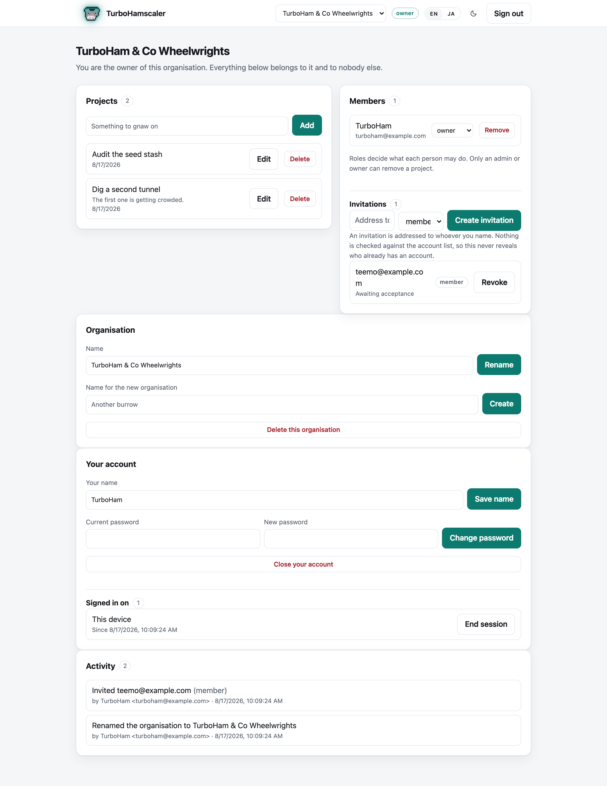
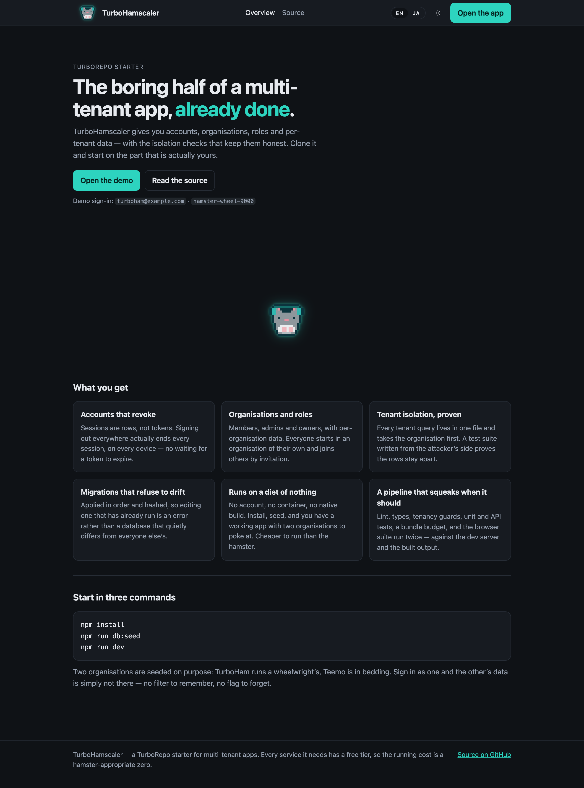
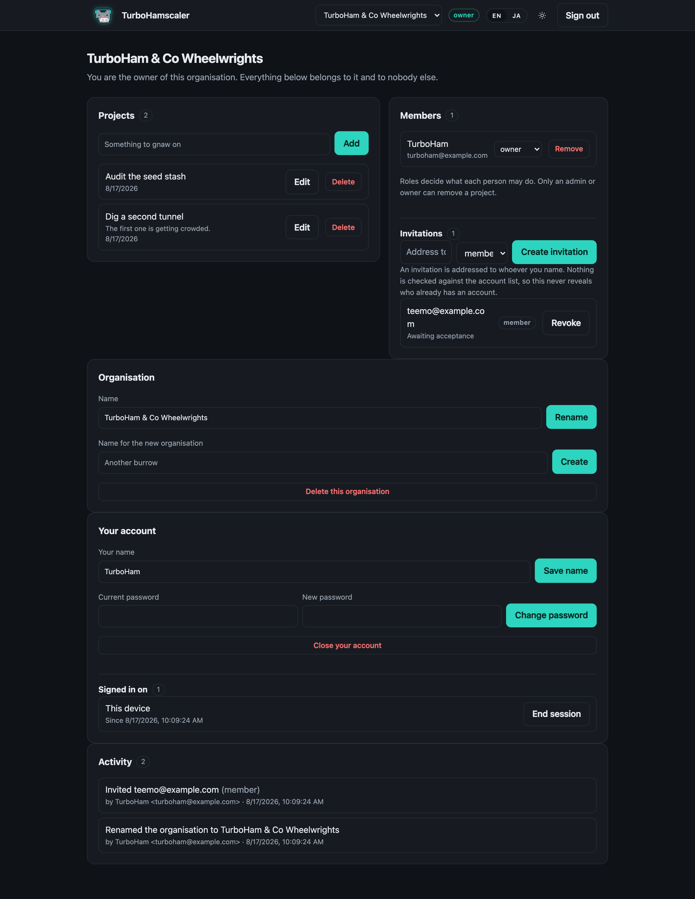

# TurboHamscaler


A **TurboRepo** starter for a multi-tenant web app: accounts, organisations, roles and
per-tenant data, with the isolation checks that keep them honest.

It runs on nothing. No account, no container, no native build — `npm install && npm run dev`
gives you a working app with a seeded demo tenant.

[](https://github.com/Artoriun/turbohamscaler/actions/workflows/ci.yml)

> **Pre-1.0 — a reference implementation, not a dependency.** The schema, the API and the layout
> of the packages still change breakingly, with no migrations between versions until 1.0.

## Try it — https://turbohamscaler-demo.onrender.com

Two accounts, in **separate organisations on purpose**: sign in as one and the other's projects,
members and audit log are simply not there.

| Sign in as | Password | What you land in |
| --- | --- | --- |
| `turboham@example.com` | `hamster-wheel-9000` | TurboHam & Co Wheelwrights, as its owner |
| `teemo@example.com` | `hamster-wheel-9000` | Teemo Industries, as its owner |

Break whatever you like — the database is rebuilt from the seed on every restart.

> The GitHub Pages copy — https://artoriun.github.io/turbohamscaler/ — is the public marketing
> pages as static files, with **no server behind them**. `/app` there says so rather than
> offering a sign-in form that cannot work.

<br clear="right">

## Where to look first

| File | The decision |
| --- | --- |
| [`packages/api/src/repo.ts`](packages/api/src/repo.ts) | Every tenant-owned query lives here and takes `orgId` first. Routes never write SQL, so a tenant filter can only be forgotten in one file. |
| [`scripts/check-tenancy.mjs`](scripts/check-tenancy.mjs) | That rule is a build failure, not a convention: CI fails if a query touches a tenant table without filtering on `org_id`, or if SQL appears outside the repository layer. |
| [`packages/api/src/isolation.test.ts`](packages/api/src/isolation.test.ts) | The same rule from the attacker's side — a signed-in user of one organisation asking for another's rows by id. Non-members get 404, never 403, because 403 confirms the organisation exists. |
| [`packages/api/src/db/postgres.ts`](packages/api/src/db/postgres.ts) | The third `Driver`, and the one that makes the interface mean something: a different wire protocol, different placeholders, and an `INTEGER` a millisecond timestamp overflows. |
| [`scripts/check-deploy.mjs`](scripts/check-deploy.mjs) | Runs the deploy blueprint's own commands against a clean checkout and then **signs in** — a health check that never touches the database cannot tell you the deploy works. |
| [`packages/api/src/password.ts`](packages/api/src/password.ts) | PBKDF2 via Web Crypto, 600,000 iterations, scheme and cost stored in the hash so they can be raised later. An unknown scheme fails closed. Web Crypto is also what lets the same code run on Workers. |

The comments explain **why**, not what. `npm run ci` runs the fourteen checks CI runs, in order.

## What it looks like

The signed-in app: per-tenant projects, members and roles, invitations, organisation and account
settings, and an audit log of who did what.



The prerendered public pages in front of it.



Light and dark are both first-class; the theme is chosen before first paint, so it never flashes.



> Building a portfolio or marketing site instead? That is
> [TurboHamstarter](https://github.com/Artoriun/turbohamstarter).

---

## Stack

| | |
| --- | --- |
| **Front end** | React, TypeScript, Vite, React Router |
| **Back end** | Hono, SQLite (`node:sqlite`), Cloudflare D1 or Postgres |
| **Tooling** | TurboRepo, Biome, Playwright |

Three workspaces: `packages/web`, `packages/api`, `packages/shared`.

---

## Quick start

**Use this template** for your own repository, or clone it to keep the history.

```bash
npm install
npm run db:seed   # a demo tenant, so the app opens on something
npm run dev       # web on 3410, API on 4410
```

Node 22 or newer (`.nvmrc`) — `node:sqlite` is what makes the database work with no native build,
and the install refuses anything older. Sign in with either account from the table above. No
`.env` is needed to run it; for production see [`.env.example`](.env.example).

### Scripts

```bash
npm run build             # production build
npm run prerender         # build, then write each public route out with its text in the markup
npm run ci                # everything CI runs, in order
npm run test              # API and unit tests
npm run test:api:postgres # the same API tests against real Postgres
npm run test:api:worker   # the same API tests against a local Worker + D1
npm run test:e2e          # Playwright, against the dev server
npm run test:e2e:dist     # the same, against the built output
npm run check:tenancy     # structural guards on tenant isolation
npm run check:deploy      # build and boot render.yaml's commands, then sign in
npm run check:budgets     # bundle and image size ceilings
npm run db:migrate        # apply pending migrations
npm run db:reset          # delete the local database and reseed
```

---

## Features

- **Accounts** — sign up, sign in, sign out everywhere; change your name or password, close your
  account. Sessions are opaque ids in a table, so revoking one really revokes it: changing a
  password ends every other session, and closing an account is refused while it is an
  organisation's only owner. Your devices are listed by a hash prefix, never by the session id —
  that id is the cookie
- **Organisations** with `member` / `admin` / `owner` roles and per-tenant projects. Anyone may
  leave except the last owner, who would strand everybody else
- **Invitations** — single-use, addressed to a person, stored only as a hash, and never checked
  against the account list, so inviting cannot reveal which addresses are registered. No mail
  provider ships: [`mailer.ts`](packages/api/src/mailer.ts) is the seam, with a worked example in
  its comments. Without one the token comes back for the admin to pass on; with one it does not
- **Tenant isolation** enforced in one file, guarded by a static check, and proven from the
  attacker's side
- **Migrations** applied in order and hashed, so editing an applied one is an error rather than a
  silent divergence
- **An audit log** of membership and invitation changes, append-only and admin-only, keeping the
  actor's name as it was — a record whose subject is deleted still reads
- **Structured logs** — one JSON line per request with a request id, the organisation and the
  caller, because "one customer or everybody" is the first question any multi-tenant incident
  asks. The id comes back on the response.
  [`observability.ts`](packages/api/src/observability.ts) is the seam, with a worked Sentry
  example and a default that reaches nobody
- **Security headers on every response**, including a content security policy that hash-pins the
  one inline script rather than allowing inline scripts generally
- **Rate-limited sign-in and writes**, recorded in the database so a restart does not reset them
- **Prerendered public pages** — every route is a real file with its text in the HTML, so a
  crawler that runs no JavaScript still sees it. Real URLs answer 200 and unknown ones 404, with
  a generated `sitemap.xml`, a `robots.txt` pointing at it, and social tags carrying the origin
  they were built for
- **Light, dark or follow the system**, chosen before first paint

---

## How tenancy works

Every tenant-owned query lives in [`repo.ts`](packages/api/src/repo.ts) and takes `orgId` first.
Routes never write SQL.

`npm run check:tenancy` fails the build if a query touches a tenant-owned table without filtering
on `org_id`, or if SQL appears outside the repository layer.
[`isolation.test.ts`](packages/api/src/isolation.test.ts) proves the behaviour end to end.

A non-member gets `404`, never `403`: a 403 confirms the organisation exists, which tells anyone
enumerating ids which ones are real.

### Adding a route

1. Add the handler in [`app.ts`](packages/api/src/app.ts).
2. Add it to `ROUTE_MANIFEST` at the bottom of that file, with what it requires.
3. Put any new query in `repo.ts`, taking `orgId` first.

`authMatrix.test.ts` reads that manifest and checks every route against an anonymous caller, a
non-member, and a member holding too low a role. A route missing from the manifest is untested,
which is why step 2 is not optional.

---

## Testing

`npm run ci` runs CI's pipeline in CI's order: Biome, `tsc`, the tenancy guards, API and unit
tests, a check that the deploy blueprint builds and signs in, the API tests again on Postgres and
again on a local Worker + D1, the build, bundle and image budgets, Playwright against the dev
server, the suite again against the built output, and Lighthouse.

**The API suite runs three times.** The same 146 assertions pass on SQLite and Postgres, and 133
of them on a Worker with D1 — the thirteen skipped reach into this process's database or swap a
module-level seam, which a separate Worker does not share. It is all local: wrangler runs on
Miniflare and Postgres runs as WebAssembly, so no account, container or database server is
needed.

**Accessibility is checked twice.** Lighthouse audits the public pages and `/app` but cannot sign
in, so `e2e/a11y.spec.ts` sweeps the signed-in portal with axe in both themes, with real content
on screen and with a project open for editing. It gates serious and critical findings only.
Neither check makes the app accessible — a green sweep is a floor, not a verdict.

Lighthouse gates accessibility, SEO, best-practices and CLS, all properties of the code. It
prints performance without gating it, because a shared runner's timings drift more than the thing
being measured; the bundle budget is the deterministic half. `npm run ci` skips it locally — run
`npm run check:lighthouse` on a quiet machine.

---

## Deployment

The two halves deploy separately, and nothing has to be deployed for the starter to be useful.

**The public pages are static.** CI builds them with `VITE_BASE` and publishes to GitHub Pages on
every push to `main`. Set `BASE_PATH` at the top of `.github/workflows/ci.yml` to your repository
name, or `/` for a custom domain.

**The app needs a server, and runs on three databases.** The routes are a
[Hono](https://hono.dev) app on Web-standard Request and Response, so the same code serves a Node
process or a Cloudflare Worker. Nothing in `packages/api/src` changes between them: the database
sits behind `Driver` (`db/index.ts`, `db/d1.ts`, `db/postgres.ts`) and password hashing uses Web
Crypto rather than `node:crypto`.

**One free instance, both halves** — [`render.yaml`](render.yaml) deploys everything to Render's
free plan, which is what the demo runs on. The API serves the built front end so both share an
origin, and that is not a shortcut: the session cookie is `SameSite=Lax`, so a browser will not
send it cross-*site*. `app.example.com` with `api.example.com` is fine, one origin is fine, but
pages and API on different sites means nobody can sign in. Splitting them for real means
`SameSite=None; Secure` **and** CSRF tokens.

**Cloudflare Workers + D1** — [`wrangler.toml`](wrangler.toml):

```bash
npx wrangler d1 create hamscaler          # paste the id into wrangler.toml
npx wrangler d1 migrations apply hamscaler --remote
npx wrangler deploy
```

Workers' free plan allows 10ms of CPU per request, and hashing a password properly costs more
than that on purpose, so this means the paid plan. Lowering the iteration count to fit the free
tier trades every stored password's security for the hosting bill.

**Postgres** — the same `Driver` against any `pg` client:

```ts
import { Pool, types } from 'pg';
types.setTypeParser(types.builtins.INT8, Number); // timestamps, not strings
setDriver(postgresDriver(new Pool({ connectionString: process.env.DATABASE_URL })));
```

### Configuration

| Variable | What it does |
| --- | --- |
| `DATABASE_URL` | Where the database lives. `node:sqlite` writes a local file, which suits one instance; point it at a hosted database for anything real |
| `DEMO_SEED` | Seeds the two demo organisations on start-up. Leave unset anywhere real |
| `SITE_URL` | The origin the pages are served from, scheme and host only. The sitemap and social tags are built from it |
| `VITE_API_URL` | Where the front end looks for the API, if they are built separately |
| `LOG_LEVEL` | `debug` / `info` / `warn` / `error` / `silent` |

A free instance has no persistent disk, so the database is rebuilt from the seed on every
restart — good for a demo, wrong for anything else. Attach a disk or use a hosted database, and
turn `DEMO_SEED` off.

### Keeping a free instance awake

A free instance sleeps after about fifteen idle minutes, and waking it costs half a minute of the
host's holding page. Any uptime monitor that requests a URL on a schedule prevents it — point one
at `/health`, which answers without touching the database, at an interval under fifteen minutes.

Staying awake around the clock spends roughly 730 of Render's 750 free instance-hours a month,
which fits one service and not two. `healthCheckPath` in [`render.yaml`](render.yaml) does not
help: Render only uses it while a deploy is going out. Nor is the deploy window itself avoidable
on the free plan — there is no zero-downtime rollout, so the holding page is what visitors get
while a new build is promoted.

---

## Contributing

See [CONTRIBUTING.md](CONTRIBUTING.md) — in particular the rules the build enforces, which are
checks rather than preferences.

## Licence

MIT — see [LICENSE](LICENSE).
